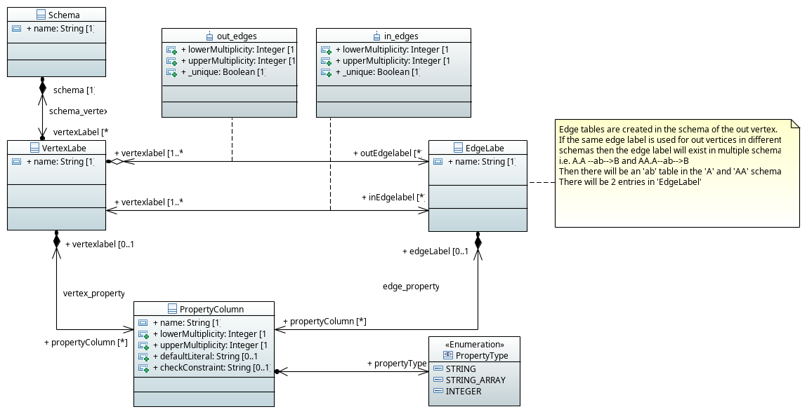

[[anchor-topology]]
== Topology

Sqlg stores the graph's topology information in the graph itself as a graph.
The topology is stored in the `sqlg_schema` schema.

.UML diagram of Sqlg's topology.



TinkerPop has no notion of schema or topology. However any TinkerPop graph has an implicit schema.
Sqlg manages the schema as a first class construct.

Sqlg follows the normal TinkerPop semantics in that the schema does not need to be defined upfront.
Every graph modification first checks to see if the element's schema (label,name) exists.
If not, it will create the element's schema. For `Postgresql` this works well as it supports transactional schema creation/modification.

[WARNING]
Hsqldb, H2 do not support transactional schema creation/modification. They will both silently commit the
transaction and continue. This breaks the user's transaction boundaries. For Hsqldb and H2 it is recommended to
create the schema upfront.

It is possible to query and traverse the topology as a normal TinkerPop graph.
To query the topology the `TopologyStrategy` is used. To facilitate ease of use, `SqlgGraph.topology()` method is added to enable the strategy.
Being able to query the topology is helpful to understand a graph's structure.

[source,java,options="nowrap"]
----
@Test
public void showTopologyTraversals() {
    Io.Builder<GraphSONIo> builder = GraphSONIo.build(GraphSONVersion.V3_0);
    final GraphReader reader = sqlgGraph.io(builder).reader().create();
    try (final InputStream stream = AbstractGremlinTest.class.getResourceAsStream("/tinkerpop-modern-v3d0.json")) {
        reader.readGraph(stream, sqlgGraph);
    } catch (IOException e) {
        Assert.fail(e.getMessage());
    } <1>
    System.out.println("//All vertex labels");
    sqlgGraph.topology().V()
            .hasLabel(Topology.SQLG_SCHEMA + "." + Topology.SQLG_SCHEMA_VERTEX_LABEL) # <2>
            .forEachRemaining(
                    v -> System.out.println(v.<String>value(Topology.SQLG_SCHEMA_VERTEX_LABEL_NAME))
            );

    System.out.println("//All edge labels");
    sqlgGraph.topology().V()
            .hasLabel(Topology.SQLG_SCHEMA + "." + Topology.SQLG_SCHEMA_VERTEX_LABEL)
            .out(Topology.SQLG_SCHEMA_OUT_EDGES_EDGE) # <3>
            .forEachRemaining(
                    v -> System.out.println(v.<String>value(Topology.SQLG_SCHEMA_EDGE_LABEL_NAME))
            );

    System.out.println("//'person' properties");
    sqlgGraph.topology().V()
            .hasLabel(Topology.SQLG_SCHEMA + "." + Topology.SQLG_SCHEMA_VERTEX_LABEL)
            .has(Topology.SQLG_SCHEMA_VERTEX_LABEL_NAME, "person") # <4>
            .out(Topology.SQLG_SCHEMA_VERTEX_PROPERTIES_EDGE) # <5>
            .forEachRemaining(
                    v -> {
                        System.out.print(v.<String>value(Topology.SQLG_SCHEMA_PROPERTY_NAME) + " : ");
                        System.out.println(v.<String>value(Topology.SQLG_SCHEMA_PROPERTY_TYPE));
                    }
            );

    System.out.println("//'software' properties");
    sqlgGraph.topology().V()
            .hasLabel(Topology.SQLG_SCHEMA + "." + Topology.SQLG_SCHEMA_VERTEX_LABEL)
            .has(Topology.SQLG_SCHEMA_VERTEX_LABEL_NAME, "software")
            .out(Topology.SQLG_SCHEMA_VERTEX_PROPERTIES_EDGE)
            .forEachRemaining(
                    v -> {
                        System.out.print(v.<String>value(Topology.SQLG_SCHEMA_PROPERTY_NAME) + " : ");
                        System.out.println(v.<String>value(Topology.SQLG_SCHEMA_PROPERTY_TYPE));
                    }
            );

    System.out.println("//'created' properties");
    sqlgGraph.topology().V()
            .hasLabel(Topology.SQLG_SCHEMA + "." + Topology.SQLG_SCHEMA_VERTEX_LABEL) # <6>
            .out(Topology.SQLG_SCHEMA_OUT_EDGES_EDGE) # <7>
            .has(Topology.SQLG_SCHEMA_EDGE_LABEL_NAME, "created") # <8>
            .out(Topology.SQLG_SCHEMA_EDGE_PROPERTIES_EDGE) # <9>
            .forEachRemaining(
                    v -> {
                        System.out.print(v.<String>value(Topology.SQLG_SCHEMA_PROPERTY_NAME) + " : ");
                        System.out.println(v.<String>value(Topology.SQLG_SCHEMA_PROPERTY_TYPE));
                    }
            );

    System.out.println("//'knows' properties");
    sqlgGraph.topology().V()
            .hasLabel(Topology.SQLG_SCHEMA + "." + Topology.SQLG_SCHEMA_VERTEX_LABEL)
            .out(Topology.SQLG_SCHEMA_OUT_EDGES_EDGE)
            .has(Topology.SQLG_SCHEMA_EDGE_LABEL_NAME, "knows")
            .out(Topology.SQLG_SCHEMA_EDGE_PROPERTIES_EDGE)
            .forEachRemaining(
                    v -> {
                        System.out.print(v.<String>value(Topology.SQLG_SCHEMA_PROPERTY_NAME) + " : ");
                        System.out.println(v.<String>value(Topology.SQLG_SCHEMA_PROPERTY_TYPE));
                    }
            );

}
----
<1> Use TinkerPop's i.o. infrastructure to load the modern graph.
<2> Find all VertexLabels, they are in `sqlg_schema.vertex`
<3> Traverse out on the `out_edges` edge to find all the edges. 'WARNING' this may produce duplicates as a single edge label
may have many different distinct out vertex labels.
<4> Find the `person` vertex.
<5> Traverse out on the `vertex_property` edge to find the 'person' vertex labels properties.
<6> Find all vertex labels. i.e. vertices in `sqlg_schema.vertex`
<7> Traverse the `out_edges` edge.
<8> Filter the out edges for only the 'created' edges.
<9> Traverse the `edge_properties` edge to find the 'created' edge's properties.


.output
----
//All vertex labels
person
software
//All edge labels
knows
created
//'person' properties
name : STRING
age : INTEGER
//'software' properties
name : STRING
lang : STRING
//'created' properties
weight : DOUBLE
//'knows' properties
weight : DOUBLE
----


=== Topology eager creation

It is often useful to create the topology upfront. The topology creation api is accessed via the `Topology` object.
It is a singleton. `Topology topology = sqlgGraph.getTopology();`
To create new topology objects use the `ensureXXX` methods. They will return a topology object representing the specific
topology element. i.e. `Schema`, `VertexLabel`, `EdgeLabel`, `PropertyColumn`, `Index`, `Partition`

[NOTE]
The `ensureXXX` methods will create the topology object if it does not exists.
If it does exist it will simply return the relevant topology object.
On any topology object one can call `isCommitted` or `isUncommitted` to check the state of the object.
`committed` indicates that it already exists. `uncommitted` indicates that it has been created in the current active transaction.

.eg
[source,java,options="nowrap"]
----
@Test
public void createModernTopology() {
    Topology topology = this.sqlgGraph.getTopology(); # <1>
    VertexLabel personVertexLabel = topology.ensureVertexLabelExist("public", "person", new HashMap<>() {{
        put("name", PropertyDefinition.of(PropertyType.STRING));
        put("age", PropertyDefinition.of(PropertyType.INTEGER));
    }}); # <2>
    VertexLabel softwareVertexLabel = topology.ensureVertexLabelExist("public", "software", new HashMap<>() {{
        put("name", PropertyDefinition.of(PropertyType.STRING));
        put("lang", PropertyDefinition.of(PropertyType.STRING));
    }});
    EdgeLabel createdEdgeLabel = personVertexLabel.ensureEdgeLabelExist("created", softwareVertexLabel, new HashMap<>() {{
        put("weight", PropertyDefinition.of(PropertyType.DOUBLE));
    }}); # <3>
    EdgeLabel knowsEdgeLabel = personVertexLabel.ensureEdgeLabelExist("knows", personVertexLabel, new HashMap<>() {{
        put("weight", PropertyDefinition.of(PropertyType.DOUBLE));
    }});
    this.sqlgGraph.tx().commit(); # <4>
}
----
<1> Get the `Topology` object.
<2> Create the 'person' VertexLabel. The `HashMap<String, PropertyDefinition>` defines the 'person''s properties.
<3> Create the 'created' EdgeLabel. The format is outVertexLabel.ensureEdgeLabelExist(name, inVertexLabel, properties)
<4> Be sure to commit the transaction. Postgresql and MSSqlServer supports transactional schema creation. Hsqldb,H2 and MariaDB do not.

[source,java,options="nowrap"]
----
@Test
public void generalTopologyCreationWithSchema() {
    Schema schema = this.sqlgGraph.getTopology().ensureSchemaExist("Humans"); # <1>
    VertexLabel personVertexLabel = schema.ensureVertexLabelExist("Person", new HashMap<>() {{
        put("name", PropertyDefinition.of(PropertyType.STRING));
        put("date", PropertyDefinition.of(PropertyType.LOCALDATE));
    }}); # <2>
    this.sqlgGraph.tx().commit();
}
----
<1> Create the 'Humans' schema
<2> Create the 'Person' VertexLabel via the Schema object.

=== PropertyDefinition

The `PropertyDefinition` class defines a Sqlg property. It is responsible for,

* PropertyType
* Multiplicity
* defaultLiteral
* checkConstraint

==== PropertyType

`PropertyType` holds all the types Sqlg supports.

==== Multiplicity

----
record Multiplicity(long lower, long upper, boolean unique, boolean ordered)
----

`lower` and `upper` specifies the cardinality limits of a property.
For a `PropertyDefinition` only `lower` and `upper` parts of `Multiplicity` is supported.

`unique` and `ordered` is not implemented for a `PropertyDefinition`.

A `lower` multiplicity of 0 indicates that the property is *not* required. +
A `lower` multiplicity of 1 indicates that the property *is* required. Sqlg will generate a `NOT NULL` clause for the property. +
A `upper` multiplicity > 1 only makes sense for a property with an array type. +
A `upper` multiplicity of -1 indicates that there is *no* upper limit. +
For a multiplicity > -1 Sqlg will generate a `CHECK` constraint to validate the multiplicity.


[source,java,options="nowrap"]
----
@Test
public void testNameIsRequired() {
    VertexLabel personVertexLabel = this.sqlgGraph.getTopology().getPublicSchema()
            .ensureVertexLabelExist("Person",
                    new HashMap<>() {{
                        put("name", PropertyDefinition.of(PropertyType.STRING, Multiplicity.of(1, 1))); # <1>
                    }}
            );
    boolean failure = false;
    try {
        this.sqlgGraph.addVertex(T.label, "Person"); #<2>
        this.sqlgGraph.tx().commit();
    } catch (Exception e) {
        LOGGER.error(e.getMessage(), e); #<3>
        failure = true;
    }
    assertTrue(failure);
}
----
<1> Specify a multiplicity of [1,1], i.e. the property is required.
<2> The `name` property is *not* specified.
<3> An exception is thrown by the database.
```
org.postgresql.util.PSQLException: ERROR: null value in column "name" of relation "V_Person" violates not-null constraint
Detail: Failing row contains (1, null).
```

[source,java,options="nowrap"]
----
@Test
public void testArrayLowerMultiplicity() {
    this.sqlgGraph.getTopology().getPublicSchema()
            .ensureVertexLabelExist("Person",
                    new HashMap<>() {{
                        put("names", PropertyDefinition.of(PropertyType.STRING_ARRAY, Multiplicity.of(2, 4))); #<1>
                    }}
            );
    this.sqlgGraph.tx().commit();
    boolean failure = false;
    try {
        this.sqlgGraph.addVertex(T.label, "Person", "names", new String[]{"John"}); #<2>
        this.sqlgGraph.tx().commit();
    } catch (Exception e) {
        LOGGER.error(e.getMessage(), e); #<3>
        failure = true;
        this.sqlgGraph.tx().rollback();
    }
    assertTrue(failure);
}
----
<1> Specify a lower multiplicity of 2. i.e. the Person must have at least 2 names.
<2> Only one name is specified.
<3> An exception is thrown by the database.
```
org.postgresql.util.PSQLException: ERROR: new row for relation "V_Person" violates check constraint "V_Person_names_check"
  Detail: Failing row contains (1, {John}).
```

[source,java,options="nowrap"]
----
@Test
public void testArrayUpperMultiplicity() {
    this.sqlgGraph.getTopology().getPublicSchema()
            .ensureVertexLabelExist("Person",
                    new HashMap<>() {{
                        put("names", PropertyDefinition.of(PropertyType.STRING_ARRAY, Multiplicity.of(2, 4))); #<1>
                    }}
            );
    this.sqlgGraph.tx().commit();
    boolean failure = false;
    try {
        this.sqlgGraph.addVertex(T.label, "Person", "names", new String[]{"John", "Joe", "Jonathan", "James", "Peter"}); #<2>
        this.sqlgGraph.tx().commit();
    } catch (Exception e) {
        LOGGER.error(e.getMessage(), e); #<3>
        failure = true;
        this.sqlgGraph.tx().rollback();
    }
    assertTrue(failure);
}
----
<1> upper multiplicity of 4 is specified. i.e. Person may not have more than 4 names.
<2> 5 names are specified.
<3> An exception is thrown by the database.
```
org.postgresql.util.PSQLException: ERROR: new row for relation "V_Person" violates check constraint "V_Person_names_check"
  Detail: Failing row contains (1, {John,Joe,Jonathan,James,Peter}).
```

==== Default values

Sqlg supports specifying a default value for a property. The value needs to be a valid literal as it is passed directly to the database without parsing.

[source,java,options="nowrap"]
----
@Test
public void testDefaultValue() {
    this.sqlgGraph.getTopology().getPublicSchema()
            .ensureVertexLabelExist("Person",
                    new HashMap<>() {{
                        put("name", PropertyDefinition.of(PropertyType.STRING, Multiplicity.of(1, 1), "'John'")); #<1>
                    }}
            );
    this.sqlgGraph.tx().commit();
    this.sqlgGraph.addVertex(T.label, "Person"); #<2>
    this.sqlgGraph.tx().commit();
    List<String> names = this.sqlgGraph.traversal().V().hasLabel("Person").<String>values("name").toList();
    assertEquals(1, names.size());
    assertEquals("John", names.get(0)); #<3>
}
----
<1> Specify a default literal `'John'` for the `name` property.
<2> Not specifying a value for the `name` property.
<3> Assert that the value is indeed the default value of `'John'`;

==== Check constraints

Sqlg supports adding `CHECK` constraints to any property.

[source,java,options="nowrap"]
----
@Test
public void testCheckConstraints() {
    this.sqlgGraph.getTopology().getPublicSchema()
            .ensureVertexLabelExist("Person",
                    new HashMap<>() {{
                        put("name", PropertyDefinition.of(PropertyType.STRING, Multiplicity.of(), "'Peter'", "name <> 'John'")); #<1>
                    }}
            );
    this.sqlgGraph.tx().commit();
    this.sqlgGraph.addVertex(T.label, "Person"); #<2>
    this.sqlgGraph.tx().commit();
    boolean failure = false;
    try {
        this.sqlgGraph.addVertex(T.label, "Person", "name", "John"); #<3>
        this.sqlgGraph.tx().commit();
    } catch (Exception e) {
        LOGGER.error(e.getMessage(), e); #<4>
        failure = true;
    }
    assertTrue(failure);
}
----
<1> Add a `CHECK` constraint that the Person's name may not be 'John'
<2> The default value is 'Peter'
<3> Try to add `John'
<4> An exception is thrown by the database.
```
org.postgresql.util.PSQLException: ERROR: new row for relation "V_Person" violates check constraint "V_Person_name_check"
  Detail: Failing row contains (2, John).
```

==== Update PropertyDefinition

Sqlg supports updating the `PropertyDefinition`.
`PropertyColumn.updatePropertyDefinition(...)` allows for updating the property's definition.

[source,java,options="nowrap"]
----
@Test
public void testUpdatePropertyDefinition() {
    this.sqlgGraph.getTopology().getPublicSchema().ensureVertexLabelExist("A", new HashMap<>() {{
        put("col1", PropertyDefinition.of(PropertyType.STRING, Multiplicity.of(0, 1))); <1>
    }});
    this.sqlgGraph.tx().commit();
    Vertex a = this.sqlgGraph.addVertex(T.label, "A");
    this.sqlgGraph.tx().commit();
    a = this.sqlgGraph.traversal().V().hasLabel("A").tryNext().orElseThrow();
    Assert.assertNull(a.value("col1")); <2>
    a.property("col1", "test"); <3>
    this.sqlgGraph.tx().commit();

    VertexLabel aVertexLabel = this.sqlgGraph.getTopology().getPublicSchema().getVertexLabel("A").orElseThrow();
    PropertyColumn propertyColumn = aVertexLabel.getProperty("col1").orElseThrow();
    propertyColumn.updatePropertyDefinition(PropertyDefinition.of(PropertyType.STRING, Multiplicity.of(1, 1))); <4>
    this.sqlgGraph.tx().commit();

    try {
        this.sqlgGraph.addVertex(T.label, "A"); <5>
        Assert.fail("not null constraint expected");
    } catch (Exception e) {
        this.sqlgGraph.tx().rollback();
    }

    propertyColumn.updatePropertyDefinition(PropertyDefinition.of(PropertyType.STRING, Multiplicity.of(1, 1), "'test'")); <6>
    a = this.sqlgGraph.addVertex(T.label, "A");
    Assert.assertEquals("test", a.value("col1")); <7>
    this.sqlgGraph.tx().commit();

    propertyColumn.updatePropertyDefinition(PropertyDefinition.of(PropertyType.STRING, Multiplicity.of(1, 1), "'test'", "(starts_with(" + sqlgGraph.getSqlDialect().maybeWrapInQoutes("col1") + ", 't'))")); <8>
    try {
        a = this.sqlgGraph.addVertex(T.label, "A", "col1", "x"); <9>
        Assert.fail("check constraint expected");
    } catch (Exception e) {
        this.sqlgGraph.tx().rollback();
    }
    a = this.sqlgGraph.addVertex(T.label, "A", "col1", "taaa"); <10>
    this.sqlgGraph.tx().commit();
}
----

<1> Property 'col1' is not required.
<2> Check that 'col1' is null.
<3> Set 'col1' to "b"
<4> Update 'col1' to be a required field.
<5> This will fail as 'col1' is not being set.
<6> Give the column a `default literal`
<7> Assert that the default literal was applied to the column.
<8> Add a check constraint that check that 'col1' must start with a 't'
<9> This will fail as 'col1' does not start with a 't'
<10> This will pass the check constraint.

=== EdgeDefinition

----
public record EdgeDefinition(Multiplicity outMultiplicity, Multiplicity inMultiplicity) {}
----

`EdgeDefinition` defines the `Multiplicity` of the in and out edge roles.

`TinkerPop` itself has no notion of multiplicity on edges labels. For `TinkerPop` all edge labels is a many-to-many relationship.
Sqlg extends the semantics by specifying the in and out multiplicity of the edge label.

==== One-to-one

One-to-one is implemented by generating a unique index on each of the `in` and `out` foreign key columns in the edge table.


[source,java,options="nowrap"]
----
@Test
public void testOneToOne() {
    VertexLabel computerVertexLabel = this.sqlgGraph.getTopology().getPublicSchema().ensureVertexLabelExist("Computer",
            new LinkedHashMap<>() {{
                put("serialNo", PropertyDefinition.of(PropertyType.STRING, Multiplicity.of(1, 1)));
            }}
    );
    VertexLabel cpuVertexLabel = this.sqlgGraph.getTopology().getPublicSchema().ensureVertexLabelExist("Cpu",
            new LinkedHashMap<>() {{
                put("serialNo", PropertyDefinition.of(PropertyType.STRING, Multiplicity.of(1, 1)));
            }}
    );
     computerVertexLabel.ensureEdgeLabelExist(
            "cpu",
            cpuVertexLabel,
            EdgeDefinition.of(
                    Multiplicity.of(1, 1),
                    Multiplicity.of(1, 1)
            )
    ); <1>
    this.sqlgGraph.tx().commit();
    this.sqlgGraph.getTopology().lock(); <2>
    Vertex computer1 = this.sqlgGraph.addVertex(T.label, "Computer", "name", "1111");
    Vertex cpu1 = this.sqlgGraph.addVertex(T.label, "Cpu", "name", "aaab");
    Vertex cpu2 = this.sqlgGraph.addVertex(T.label, "Cpu", "name", "aaac");
    computer1.addEdge("cpu", cpu1);
    this.sqlgGraph.tx().commit();
    try {
        computer1.addEdge("cpu", cpu2); <3>
    } catch (RuntimeException e) {
        if (isPostgres()) {
            Assert.assertTrue(e.getMessage().contains("duplicate key value violates unique constraint"));
        }
    }
    this.sqlgGraph.tx().rollback();
    Vertex computer2 = this.sqlgGraph.addVertex(T.label, "Computer", "name", "2222");
    try {
        computer2.addEdge("cpu", cpu1); <4>
    } catch (RuntimeException e) {
        if (isPostgres()) {
            Assert.assertTrue(e.getMessage().contains("duplicate key value violates unique constraint"));
        }
    }
    this.sqlgGraph.tx().rollback();
}
----

<1> Specified a one-to-one association between Computer and Cpu
<2> Lock the topology to ensure no further schema elements are created on the db.
<3> Fails as the computer already has a cpu.
<4> Fails as the cpu already has a computer.

The constraints on the edge table.
[source,sql,options="nowrap"]
----
CREATE UNIQUE INDEX IF NOT EXISTS "E_cpu_public.Computer__O_idx"
    ON public."E_cpu" USING btree
    ("public.Computer__O" ASC NULLS LAST)
    TABLESPACE pg_default;

CREATE UNIQUE INDEX IF NOT EXISTS "E_cpu_public.Cpu__I_idx"
    ON public."E_cpu" USING btree
    ("public.Cpu__I" ASC NULLS LAST)
    TABLESPACE pg_default;
----

==== One-to-many

One-to-many can only be efficiently implemented on the database if the many side is also `unique`. `unique` implies set semantics, that no element on the many side will repeat.

One-to-many is implemented by generating a unique index over both the `in` and `out` foreign key columns in the edge table.

[source,java,options="nowrap"]
----
@Test
public void testOneToMany() {
    VertexLabel personVertexLabel = this.sqlgGraph.getTopology().getPublicSchema().ensureVertexLabelExist("Person",
            new LinkedHashMap<>() {{
                put("name", PropertyDefinition.of(PropertyType.STRING, Multiplicity.of(1, 1)));
            }}
    );
    VertexLabel countryVertexLabel = this.sqlgGraph.getTopology().getPublicSchema().ensureVertexLabelExist("Country",
            new LinkedHashMap<>() {{
                put("name", PropertyDefinition.of(PropertyType.STRING, Multiplicity.of(1, 1)));
            }}
    );
    personVertexLabel.ensureEdgeLabelExist(
            "visited",
            countryVertexLabel,
            EdgeDefinition.of(
                    Multiplicity.of(0, 1),
                    Multiplicity.of(-1, -1, true)
            )
    ); <1>
    this.sqlgGraph.tx().commit();
    this.sqlgGraph.getTopology().lock();
    Vertex john = this.sqlgGraph.addVertex(T.label, "Person", "name", "John");
    Vertex usa = this.sqlgGraph.addVertex(T.label, "Country", "name", "USA");
    Vertex sa = this.sqlgGraph.addVertex(T.label, "Country", "name", "SA");
    john.addEdge("visited", usa);
    john.addEdge("visited", sa); <2>
    this.sqlgGraph.tx().commit();
    try {
        john.addEdge("visited", usa); <3>
    } catch (RuntimeException e) {
        if (isPostgres()) {
            Assert.assertTrue(e.getMessage().contains("duplicate key value violates unique constraint"));
        }
    }
    this.sqlgGraph.tx().rollback();
    Vertex peter = this.sqlgGraph.addVertex(T.label, "Person", "name", "John");
    peter.addEdge("visited", usa); <4>
    this.sqlgGraph.tx().commit();
}
----
<1> Create a one-to-many edge with the many side specified as `unique`.
<2> Add another `visited` edge to a country.
<3> This fails as the john has already 'visited' the 'USA'
<4> Peter can visit the 'USA'

The constraint on the edge table.

[source,sql,options="nowrap"]
----
CREATE UNIQUE INDEX IF NOT EXISTS "E_visited_public.Person__O_public.Country__I_idx"
    ON public."E_visited" USING btree
    ("public.Person__O" ASC NULLS LAST, "public.Country__I" ASC NULLS LAST)
    TABLESPACE pg_default;
----

==== Many-to-many (unique)

The database can efficiently check the uniqueness of a many-to-many association. This means that there can be not be more than one edge between any two vertices.

many-to-many (unique) is implemented by generating a unique index over both the `in` and `out` foreign key columns in the edge table.

[source,java,options="nowrap"]
----
@Test
public void testUniqueManyToMany() {
    VertexLabel personVertexLabel = this.sqlgGraph.getTopology().getPublicSchema().ensureVertexLabelExist("Person",
            new LinkedHashMap<>() {{
                put("name", PropertyDefinition.of(PropertyType.STRING, Multiplicity.of(1, 1)));
            }}
    );
    VertexLabel vehicleVertexLabel = this.sqlgGraph.getTopology().getPublicSchema().ensureVertexLabelExist("Vehicle",
            new LinkedHashMap<>() {{
                put("name", PropertyDefinition.of(PropertyType.STRING, Multiplicity.of(1, 1)));
            }}
    );
    personVertexLabel.ensureEdgeLabelExist(
            "drives",
            vehicleVertexLabel,
            EdgeDefinition.of(
                    Multiplicity.of(-1, -1, true),
                    Multiplicity.of(-1, -1, true)
            )
    ); <1>
    this.sqlgGraph.tx().commit();
    this.sqlgGraph.getTopology().lock();
    Vertex john = this.sqlgGraph.addVertex(T.label, "Person", "name", "John");
    Vertex peter = this.sqlgGraph.addVertex(T.label, "Person", "name", "Peter");
    Vertex toyota = this.sqlgGraph.addVertex(T.label, "Vehicle", "name", "Toyota");
    Vertex kia = this.sqlgGraph.addVertex(T.label, "Vehicle", "name", "Kia");
    john.addEdge("drives", toyota);
    john.addEdge("drives", kia);
    peter.addEdge("drives", toyota);
    peter.addEdge("drives", kia);
    this.sqlgGraph.tx().commit(); <2>
    try {
        john.addEdge("drives", toyota); <3>
    } catch (RuntimeException e) {
        if (isPostgres()) {
            Assert.assertTrue(e.getMessage().contains("duplicate key value violates unique constraint"));
        }
    }
    this.sqlgGraph.tx().rollback();
}
----
<1> Create a many-to-many unique edge label.
<2> John drives multiple cars and Toyota has multiple drivers.
<3> No duplicate edges are allowed.

The constraint on the edge table.

[source,sql,options="nowrap"]
----
CREATE UNIQUE INDEX IF NOT EXISTS "E_drives_public.Person__O_public.Vehicle__I_idx"
    ON public."E_drives" USING btree
    ("public.Person__O" ASC NULLS LAST, "public.Vehicle__I" ASC NULLS LAST)
    TABLESPACE pg_default;
----

==== one-to-many, many-to-many, multiplicity

Currently Sqlg does not automatically check the multiplicities as no efficient way of doing it has been found.

However sqlg does provide a helper method for application code to call to validate multiplicities. There are two checks the user can call. Either for an individual vertex or for a VertexLabel.

===== 1 checkMultiplicity (per vertex)

[source,java,options="nowrap"]
----
@Test
public void testCheckMultiplicitiesPerVertex() {
    VertexLabel personVertexLabel = this.sqlgGraph.getTopology().getPublicSchema().ensureVertexLabelExist("Person",
            new LinkedHashMap<>() {{
                put("name", PropertyDefinition.of(PropertyType.STRING, Multiplicity.of(1, 1)));
            }}
    );
    VertexLabel addressVertexLabel = this.sqlgGraph.getTopology().getPublicSchema().ensureVertexLabelExist("Address",
            new LinkedHashMap<>() {{
                put("name", PropertyDefinition.of(PropertyType.STRING, Multiplicity.of(1, 1)));
            }}
    );
    EdgeLabel personAddressEdgeLabel = personVertexLabel.ensureEdgeLabelExist(
            "address",
            addressVertexLabel,
            EdgeDefinition.of(
                    Multiplicity.of(0, 1, true),
                    Multiplicity.of(1, 3, true)
            )
    ); <1>
    this.sqlgGraph.tx().commit();
    this.sqlgGraph.getTopology().lock();
    Vertex john = this.sqlgGraph.addVertex(T.label, "Person", "name", "John");
    Vertex peter = this.sqlgGraph.addVertex(T.label, "Person", "name", "peter");
    Vertex johnHomeAddress = this.sqlgGraph.addVertex(T.label, "Address", "name", "home");
    Vertex johnWorkAddress = this.sqlgGraph.addVertex(T.label, "Address", "name", "work");
    Vertex johnVacationAddress = this.sqlgGraph.addVertex(T.label, "Address", "name", "vacation");
    try {
        this.sqlgGraph.tx().checkMultiplicity(john, Direction.OUT, personAddressEdgeLabel, addressVertexLabel);
    } catch (RuntimeException e) {
        if (isPostgres()) {
            assertTrue(e.getMessage().contains("Multiplicity check for EdgeLabel 'address' fails.\n" +
                    "Lower multiplicity is 1 current lower multiplicity is 0"));
        }
    }
    john.addEdge("address", johnHomeAddress);
    john.addEdge("address", johnWorkAddress);
    john.addEdge("address", johnVacationAddress);
    this.sqlgGraph.tx().checkMultiplicity(john, Direction.OUT, personAddressEdgeLabel, addressVertexLabel); <2>

    peter.addEdge("address", johnHomeAddress);
    boolean fails = false;
    try {
        this.sqlgGraph.tx().checkMultiplicity(johnHomeAddress, Direction.IN, personAddressEdgeLabel, personVertexLabel); <3>
    } catch (RuntimeException e) {
        fails = true;
        if (isPostgres()) {
            System.out.println(e.getMessage());
            assertTrue(e.getMessage().contains("Multiplicity check for EdgeLabel 'address' fails.\n" +
                    "Upper multiplicity is 1 current upper multiplicity is 2"));
        }
    }
    assertTrue(fails);
    this.sqlgGraph.tx().commit();
}
----
<1> A `Person` must have at least one `Address` but no more than three.
An `Address` can only be associated to zero or one `Person`
<2> Check the multiplicity of 'john's addresses. It passes as its between 1 and 3.
<3> Check that John's home address is associated to only on `Person`. It fails as its also been associated to 'peter'.

===== 2 checkMultiplicity (per VertexLabel)

[source,java,options="nowrap"]
----
@Test
public void testCheckMultiplicitiesPerVertexLabel() {
    VertexLabel personVertexLabel = this.sqlgGraph.getTopology().getPublicSchema().ensureVertexLabelExist("Person",
            new LinkedHashMap<>() {{
                put("name", PropertyDefinition.of(PropertyType.STRING, Multiplicity.of(1, 1)));
            }}
    );
    VertexLabel addressVertexLabel = this.sqlgGraph.getTopology().getPublicSchema().ensureVertexLabelExist("Address",
            new LinkedHashMap<>() {{
                put("name", PropertyDefinition.of(PropertyType.STRING, Multiplicity.of(1, 1)));
            }}
    );
    EdgeLabel personAddressEdgeLabel = personVertexLabel.ensureEdgeLabelExist(
            "address",
            addressVertexLabel,
            EdgeDefinition.of(
                    Multiplicity.of(0, 1, true),
                    Multiplicity.of(1, 3, true)
            )
    );
    this.sqlgGraph.tx().commit();
    this.sqlgGraph.getTopology().lock();
    Vertex john = this.sqlgGraph.addVertex(T.label, "Person", "name", "John");
    Vertex peter = this.sqlgGraph.addVertex(T.label, "Person", "name", "peter");
    Vertex johnHomeAddress = this.sqlgGraph.addVertex(T.label, "Address", "name", "home");
    Vertex johnWorkAddress = this.sqlgGraph.addVertex(T.label, "Address", "name", "work");
    Vertex johnVacationAddress = this.sqlgGraph.addVertex(T.label, "Address", "name", "vacation");
    john.addEdge("address", johnHomeAddress);
    john.addEdge("address", johnWorkAddress);
    john.addEdge("address", johnVacationAddress);
    peter.addEdge("address", johnHomeAddress);

    this.sqlgGraph.tx().checkMultiplicity(personVertexLabel, Direction.OUT, personAddressEdgeLabel, addressVertexLabel);
    boolean fails = false;
    try {
        this.sqlgGraph.tx().checkMultiplicity(addressVertexLabel, Direction.IN, personAddressEdgeLabel, personVertexLabel);
    } catch (RuntimeException e) {
        fails = true;
        if (isPostgres()) {
            System.out.println(e.getMessage());
            String msg = String.format("Multiplicity check for EdgeLabel 'address' fails for '%s'.\nUpper multiplicity is [1] current multiplicity is [2]", johnHomeAddress.id().toString());
            System.out.println(msg);
            assertTrue(e.getMessage().contains(msg));
        }
    }
    assertTrue(fails);
    this.sqlgGraph.tx().commit();
}
----

=== Query the topology

Sqlg keeps an in-memory cache of the graphs entire topology. It is possible query this cache directly.

[source,java,options="nowrap"]
----
@Test
public void queryCache() {
    loadModern();
    Optional<Schema> publicSchema = this.sqlgGraph.getTopology().getSchema(this.sqlgGraph.getSqlDialect().getPublicSchema()); # <1>
    assertTrue(publicSchema.isPresent());
    Schema publicSchemaViaShortCut = this.sqlgGraph.getTopology().getPublicSchema(); # <2>
    Optional<VertexLabel> personVertexLabel = publicSchema.get().getVertexLabel("person"); # <3>
    assertTrue(personVertexLabel.isPresent());
    Optional<EdgeLabel> createEdgeLabel = personVertexLabel.get().getOutEdgeLabel("created"); # <4>
    assertTrue(createEdgeLabel.isPresent());
    Optional<EdgeLabel> knowsEdgeLabel = personVertexLabel.get().getOutEdgeLabel("knows"); # <5>
    assertTrue(knowsEdgeLabel.isPresent());

    Optional<PropertyColumn> namePropertyColumn = personVertexLabel.get().getProperty("name"); # <6>
    assertTrue(namePropertyColumn.isPresent());
    assertEquals(PropertyType.STRING, namePropertyColumn.get().getPropertyType()); # <7>
    Optional<PropertyColumn> agePropertyColumn = personVertexLabel.get().getProperty("age");
    assertTrue(agePropertyColumn.isPresent());
    assertEquals(PropertyType.INTEGER, agePropertyColumn.get().getPropertyType());
    Optional<PropertyColumn> weightPropertyColumn = createEdgeLabel.get().getProperty("weight");
    assertTrue(weightPropertyColumn.isPresent());
    assertEquals(PropertyType.DOUBLE, weightPropertyColumn.get().getPropertyType());
}
----
<1> Get the 'public' schema object.
<2> Because the 'public' schema will always exist there is a shortcut method to get it.
<3> Use the 'Schema' object the get the 'person' VertexLabel
<4> Use the 'person' VertexLabel to get its 'created' out edge.
<5> Use the 'person' VertexLabel to get its 'knows' out edge.
<6> Use the 'person' VertexLabel to get its 'name' property. Properties are represented by the `PropertyColumn` class.
<7> On the `PropertyColumn` object one can get the `PropertyType`. PropertyType is an enum representing all data types supported by Sqlg.

[[anchor-user-supplied-identifiers]]
=== User supplied identifiers

You can define your own identifiers for a VertexLabel or EdgeLabel. This will result in Sqlg generating primary keys on the specified identifiers instead of using an auto generated sequence.

.eg.
[source,java,options="nowrap"]
----
@Test
public void testUserSuppliedIds() {
    VertexLabel personVertexLabel = this.sqlgGraph.getTopology().getPublicSchema().ensureVertexLabelExist(
            "Person",
            new LinkedHashMap<>() {{
                put("name", PropertyDefinition.of(PropertyType.STRING));
                put("surname", PropertyDefinition.of(PropertyType.STRING));
                put("nickname", PropertyDefinition.of(PropertyType.STRING));
            }},
            ListOrderedSet.listOrderedSet(Arrays.asList("name", "surname")) # <1>
    );
    personVertexLabel.ensureEdgeLabelExist(
            "marriedTo",
            personVertexLabel,
            new LinkedHashMap<>() {{
                put("place", PropertyDefinition.of(PropertyType.STRING));
                put("when", PropertyDefinition.of(PropertyType.LOCALDATETIME));
            }},
            ListOrderedSet.listOrderedSet(List.of("place", "when")) # <2>
    );
    this.sqlgGraph.tx().commit();

    Vertex john = this.sqlgGraph.addVertex(T.label, "Person", "name", "John", "surname", "Longfellow", "nickname", "Longboy");
    Vertex sue = this.sqlgGraph.addVertex(T.label, "Person", "name", "Sue", "surname", "Pretty");
    john.addEdge("marriedTo", sue, "place", "Timbuck2", "when", LocalDateTime.now());
    this.sqlgGraph.tx().commit();

    List<Vertex> marriedTo = this.sqlgGraph.traversal().V().hasLabel("Person")
            .has("name", "John")
            .out("marriedTo")
            .toList();
    Assert.assertEquals(1, marriedTo.size());
    Assert.assertEquals(sue, marriedTo.get(0));
}
----
<1> Specify the `name` and `surname` properties as the primary key for the `Person` vertex label.
<2> Specify the  `place` and `when` properties as the primary key for the `marriedTo` edge label.

This will generate a table with `name` and `surname`, and `place` and `when` as composite primary keys.

[source,sql,options="nowrap"]
----
CREATE TABLE public."V_Person"
(
    name text COLLATE pg_catalog."default" NOT NULL,
    surname text COLLATE pg_catalog."default" NOT NULL,
    nickname text COLLATE pg_catalog."default",
    CONSTRAINT "V_Person_pkey" PRIMARY KEY (name, surname)
);

CREATE TABLE public."E_marriedTo"
(
    place text COLLATE pg_catalog."default" NOT NULL,
    "when" timestamp without time zone NOT NULL,
    "public.Person.name__I" text COLLATE pg_catalog."default",
    "public.Person.surname__I" text COLLATE pg_catalog."default",
    "public.Person.name__O" text COLLATE pg_catalog."default",
    "public.Person.surname__O" text COLLATE pg_catalog."default",
    CONSTRAINT "E_marriedTo_pkey" PRIMARY KEY (place, "when"),
    CONSTRAINT "E_marriedTo_public.Person.name__I_public.Person.surname__I_fkey" FOREIGN KEY ("public.Person.name__I", "public.Person.surname__I")
        REFERENCES public."V_Person" (name, surname) MATCH SIMPLE
        ON UPDATE NO ACTION
        ON DELETE NO ACTION
        DEFERRABLE,
    CONSTRAINT "E_marriedTo_public.Person.name__O_public.Person.surname__O_fkey" FOREIGN KEY ("public.Person.name__O", "public.Person.surname__O")
        REFERENCES public."V_Person" (name, surname) MATCH SIMPLE
        ON UPDATE NO ACTION
        ON DELETE NO ACTION
        DEFERRABLE
)
----

The gremlin query will execute the following sql,
[source,sql,options="nowrap"]
----
SELECT
	a2."alias1", a2."alias2", a2."alias3"
FROM (
SELECT
	"public"."E_marriedTo"."public.Person.name__I" AS "public.E_marriedTo.public.Person.name__I",
	"public"."E_marriedTo"."public.Person.surname__I" AS "public.E_marriedTo.public.Person.surname__I"
FROM
	"public"."V_Person" INNER JOIN
	"public"."E_marriedTo" ON "public"."V_Person"."name" = "public"."E_marriedTo"."public.Person.name__O" AND "public"."V_Person"."surname" = "public"."E_marriedTo"."public.Person.surname__O"
WHERE
	( "public"."V_Person"."name" = ?)
) a1 INNER JOIN (
SELECT
	"public"."V_Person"."name" AS "alias1",
	"public"."V_Person"."surname" AS "alias2",
	"public"."V_Person"."nickname" AS "alias3"
FROM
	"public"."V_Person"
) a2 ON a1."public.E_marriedTo.public.Person.name__I" = a2."alias1" AND a1."public.E_marriedTo.public.Person.surname__I" = a2."alias2"
----

=== Lock the topology

It is possible to lock the topology. This will prevent any creation of topology elements without explicitly unlocking the topology.
The topology can only be locked globally. However, there are two ways to unlock the topology. Either globally or per transaction.
Unlocking the topology on the transaction unlocks the topology only for the current transaction. This means that globally
the topology remains locked and that other threads (transactions) will not be able to change the topology. To do so they
too will have to first unlock the topology.  There is no need to lock the topology again for the transaction. It will
automatically do so on `commit` or `rollback`.

[source,sql,options="nowrap"]
----
@Test
public void topologyGlobalLockUnlock() {
    this.sqlgGraph.getTopology().lock(); # <1>
    try {
        this.sqlgGraph.addVertex(T.label, "A"); # <2>
        Assert.fail("Expected IllegalStateException");
    } catch (IllegalStateException e) {
        //The topology is locked so an IllegalStateException is thrown.
    }
    this.sqlgGraph.getTopology().unlock(); # <3>
    this.sqlgGraph.addVertex(T.label, "A"); # <4>
    this.sqlgGraph.tx().commit();
    Assert.assertTrue(this.sqlgGraph.getTopology()
            .getPublicSchema()
            .getVertexLabel("A")
            .isPresent());
}
----
<1> Globally lock the topology.
<2> Try to create a VertexLabel 'A', it will fail with an `IllegalStateException` as the topology is locked.
<3> Globally unlock the topology.
<4> Create a VertexLabel 'A'. This time it will succeed as the topology is not locked.


[source,sql,options="nowrap"]
----
@Test
public void topologyGlobalLockTransactionUnlock() {
    this.sqlgGraph.getTopology().lock(); # <1>
    this.sqlgGraph.tx().unlockTopology(); # <2>
    this.sqlgGraph.addVertex(T.label, "A"); # <3>
    this.sqlgGraph.tx().commit(); # <4>
    Assert.assertTrue(this.sqlgGraph.getTopology()
            .getPublicSchema()
            .getVertexLabel("A")
            .isPresent());
}
----

<1> Globally lock the topology.
<2> Unlock the topology only for the current transaction.
<3> Create a VertexLabel 'A'. This will succeed for the current transaction.
<4> On commit the `unlockTopology` is automatically no longer valid.

